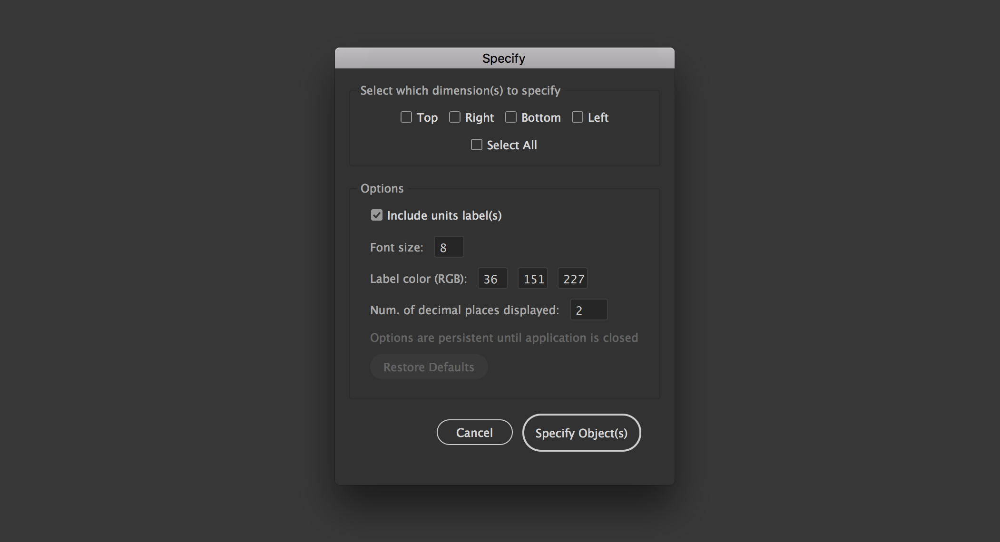

# SPECIFY
Illustrator script to specify the dimensions of single or multiple objects, or to specify the dimensions between two objects.

[](https://github.com/adamdehaven/Specify/archive/master.zip) 
[](https://github.com/adamdehaven/Specify/compare/v1.2.2...master) 
[](https://github.com/adamdehaven/Specify/issues) 
[](https://raw.githubusercontent.com/adamdehaven/Specify/master/LICENSE)


##### Save to Default Scripts
> To allow the script to show as an option within the default `Scripts` menu, save the script in the following location _(path shown is for Mac. Your actual path may vary)_
> ```
> Applications > Adobe Illustrator [YOUR VERSION] > Presets > en_US > Scripts
> ```

Alternatively, you may save the script in a folder of your choosing.

## REQUIREMENTS
1. Must have an open document in Illustrator
2. Must have at least 1 object selected via Illustrator's Selection Tool (V) or Direct Selection Tool (A)

## HOW TO RUN
If you saved the script as [described above](#save-to-default-scripts), you should be able to run the script (after selecting object(s) in the document) by navigating within Illustrator to:
```
File > Scripts > Specify
```
If you chose an alternate location to save the script, you may run by using the following path, and selecting the script file once you navigate to your designated folder:
```
File > Scripts > Other Script...
```

#### Specify Dialog
After choosing to run the script, you will be presented with a dialog that allows you to choose which dimension(s) to specify. The dialog also allows you to edit the default options. **Any changes to the options panel will persist until you close the application (even if you run the script in another document).**



#### Dimension Single or Multiple Objects
Select a single object (or group) or multiple objects on your artboard and [run the script](#how-to-run) within Illustrator.

With a single object or multiple objects selected, the script will display a dialog box allowing you to choose which sides to dimension for all objects simultaneously, as well as customizable options. Click 'Specify Object(s)' and the script will output the selected dimensions to the **SPEC** layer (which is automatically created if needed).

#### Dimension Between Two Objects
Select two objects and [run the script](#how-to-run) within Illustrator.

With two objects selected, the script will display a new option within the dialog box, **Dimension between objects**. When checked, this option will specify the selected dimension(s) between the two chosen objects.

#### Example


#### Units
The script automatically dimensions objects based on the Document's default units. To dimension in different units (i.e. Inches, Centimeters, etc.) follow the instructions below:
> 1. In your document, select show Rulers via `View > Rulers > Show Rulers` ( <kbd>⌘Cmd</kbd> + <kbd>R</kbd> on Mac, <kbd>Ctrl</kbd> + <kbd>R</kbd> on PC )
> 2. Right click on the Ruler, and select your desired units. Otherwise, the script will use the Document's selected units by default.
> 3. Run the script and you will now get output as shown in the example below


The units label is optional. A checkbox is included in the Specify dialog box that allows the user to turn the units label on or off.
##### Examples
Units Label On: 
> **220.00 px**

Units Label Off: 
> **220.00**
